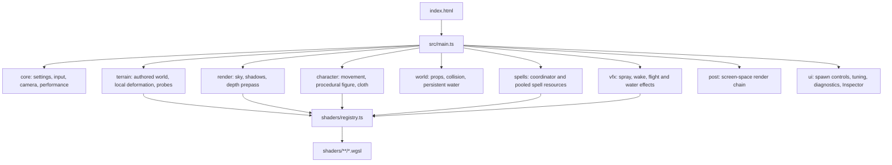
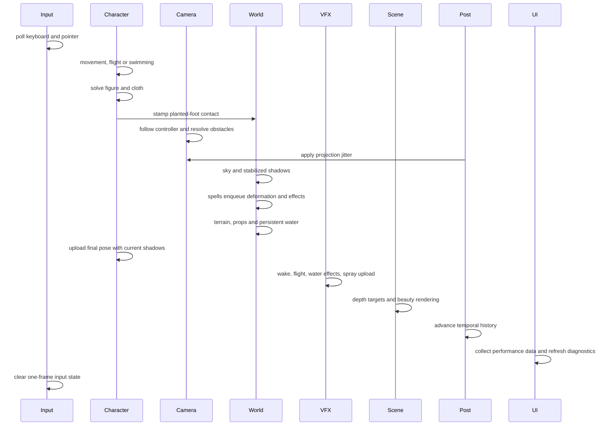

# Exalted application architecture

This document describes the production world application served by `index.html`.
It covers the TypeScript code under `src`, its runtime order, major data paths,
and extension points. The standalone mountain and forest pages are prototypes and
are described separately under [Demo boundaries](#demo-boundaries).

## System overview

Exalted is a WebGPU-only Babylon.js application. It uses Babylon for device and
scene management, resources, cameras, meshes, and render passes. World simulation,
terrain deformation, character animation, spells, atmosphere, shadows, and
post-processing are custom systems with custom WGSL.

`src/main.ts` is the composition root. It creates systems in dependency order,
warms their GPU resources, and runs one ordered update loop. Systems own their
resources and expose small methods such as `update`, `warmUp`, `reset`, and
`registerPrepass`. There is no general entity-component framework or event bus.



## Runtime modes

The default mode loads the authored Exalted world:

- `alpha-map.glb` supplies terrain geometry and biome vertex colours.
- `exalted_desert.glb` supplies authored desert vegetation and rocks.
- Water geometry is derived from retained terrain vertices plus
  `world/waterReference.json`.
- The spawn bar exposes named locations and texture and wind controls.

`?terrain=procedural` selects the original procedural snow terrain. It uses
the nested clipmap and generated heightfield and keeps geometric snow deformation
available as an isolated reference mode. Authored world water and desert props are
only created for the Exalted mode.

`?gpuTiming=1` enables Babylon GPU timestamp capture where the browser and driver
support it. It remains opt-in because unsupported timestamp writes can invalidate
a WebGPU command buffer.

## Startup and ownership

Startup is deliberately sequential because later systems consume resources owned
by earlier ones.

1. Validate the required canvas and WebGPU support.
2. Create and initialize `WebGPUEngine`.
3. Register raw WGSL sources in Babylon's shader stores.
4. Create the `Scene`, camera rig, analytic sky, cascaded shadows, and depth
   prepass.
5. Build the selected terrain mode.
6. In Exalted mode, derive persistent water and load authored desert props.
7. Create the movement controller and place it at the initial spawn.
8. Create the procedural character, shared spray pool, terrain contact system,
   surf wake, flight feedback, water effects, and spells.
9. Connect collision, prepass, shadow, spell-light, and settings dependencies.
10. Create post-processing and UI.
11. Warm materials, meshes, render targets, and post passes behind the loading
    screen.
12. Render three complete warm-up frames, then start the normal render loop.

The owner that constructs a resource normally disposes it through the scene
disposal lifecycle. Shared pools remain owned by their top-level system:

- `Terrain` owns deformable terrain state and terrain materials.
- `Character` owns procedural figure meshes, materials, skeleton data, and cloth.
- `SprayField` owns the bounded particle pool used by movement, water, and spells.
- `SpellSystem` owns spell instances, pooled water strands, crystals, and lights.
- `PostChain` owns temporal history and its post-process passes.

After startup, `globalThis.EXALTED` exposes the constructed runtime for browser
inspection. It is a typed diagnostics surface, not an internal dependency locator.

## Frame lifecycle

Ordering in the frame loop is part of the architecture. Moving a step can produce
one-frame lag, stale shadow matrices, missed deformation brushes, or particles
uploaded after their emitters run.



Before each frame, pending resize or render-scale changes are applied. They are
queued from DOM callbacks because reconfiguring the WebGPU canvas while a command
buffer still references its swap texture is unsafe.

Spawn changes are also consumed at the frame boundary. A spawn transition resets
input, spells, the ground probe, character movement and pose, contact history,
wake and spray state, camera state, and temporal post history before selecting the
new UI location.

## Terrain and biome data

`Terrain` is the facade used by movement, rendering, effects, and spells. It
selects one of two base surfaces:

- `ExaltedWorld` loads the authored GLB, bakes the source hierarchy transform
  into vertex data, retains a CPU `MeshSurface`, and exposes height, normal, and
  biome-weight queries.
- `Heightfield` generates the procedural terrain textures and CPU sampling data.

The authored terrain's vertex colours are gameplay data. `surfaceTypes.ts`
defines their classification and generates matching WGSL, keeping CPU collision,
water, deformation, and GPU shading thresholds aligned.

`LocalTerrain` extracts the deformable region near the active world position.
`DeformationField` owns a persistent, camera-following pair of GPU state buffers.
Feet, surfing, and spells enqueue brushes into the same state. The terrain beauty,
depth, and shadow shaders read the same deformation include so displaced geometry
and its shadows agree.

`GroundProbe` reads localized GPU-ground information back for alignment where
needed. Imported terrain collision and general character grounding use the retained
CPU triangle surface rather than a separate collision GLB.

## Props, LOD, and collision

`DesertProps` imports authored desert placements, groups compatible geometry and
materials, and renders repeated content with thin instances. Near and far buffers
provide the current two-level prop LOD system. Wind deformation is applied in the
prop shaders and shared with relevant depth and shadow passes.

`PropCollisions` builds inexpensive collision primitives for meaningful solid
props. Rocks and trunks can block character and camera movement; bushes and small
vegetation are excluded. The movement solver supports swept horizontal collision,
sliding, vertical separation, recovery from overlap, and flat-top support for
landing.

Terrain itself currently uses the authored model as one mesh. Dedicated terrain
LOD is deferred because there is one world terrain asset; biome vegetation and
future repeated assets are the higher-value LOD targets.

## Character and movement

`CharacterController` owns authoritative motion state. Walking, surfing,
swimming, and timed flight share its position, velocity, facing, grounding, lean,
and animation signals. Mode-specific helpers consume narrow terrain and camera
contracts rather than the complete renderer.

`Character` is the rendering owner. The avatar is generated procedurally:

- `figure.ts` defines skeleton state and pose solving.
- `build.ts` constructs skinned geometry.
- `cloth.ts` simulates garment panels with Verlet constraints and collision.
- `snowContact.ts` converts planted feet and surfing movement into terrain
  deformation and spray.

The controller updates before the figure. Contact updates after pose solving so a
footprint uses the solved boot position. Final GPU pose synchronization happens
after shadows update so character materials receive current-frame cascade data.

See [AVATAR.md](AVATAR.md) for the asset-editing and replacement strategy.

## Water

World water is split by responsibility:

- `waterGeometry.ts` derives lake and river meshes from authored terrain.
- `waterSurface.ts` provides swimming samples and waterfall emitter clusters.
- `WorldWater` renders persistent lake and river surfaces and owns ripple state.
- `Swimming` controls avatar motion on valid deep-water coverage.
- `WaterEffects` turns swimming and nearby waterfall sites into ripples, spray,
  and mist through the shared particle pool.

Water construction validates that the terrain contains loaded Exalted vertex data.
This keeps procedural mode from accidentally entering an authored-world-only path.

## Spells and shared effects

`SpellSystem` is the coordinator for keyboard routing, cast lifecycle, reset,
warm-up, prepass registration, and triangle accounting. Individual spell classes
own their state machines and geometry but receive a shared `SpellContext`.

Shared resources keep spell cost bounded:

- `WaterBody` provides a fixed pool of swept water strands.
- `CrystalField` provides pooled crystal geometry.
- `SpellLights` provides four light slots consumed by world materials.
- `SprayField` provides one fixed-capacity particle pool.
- All terrain changes pass through `DeformationField.brush()`.

This means active spell count changes buffer contents and visibility rather than
creating an unbounded number of render resources.

## Rendering pipeline

The custom renderer has four connected layers:

1. `Sky` solves the atmosphere LUT, sun radiance, irradiance, and sky rendering.
2. `ShadowSystem` renders three stabilized custom cascades. Each caster supplies
   the vertex shader that matches its displaced or animated beauty geometry.
3. `DepthPass` renders camera-space depth and the material mask used by
   screen-space effects.
4. `PostChain` applies TAA, SSR, light shafts, bloom downsample and blur, depth
   of field, tonemapping, and sharpening.

Terrain and persistent world water use rendering group 1, while the shared spray
mesh uses group 2. Automatic depth clearing for groups 1 and 2 is disabled in
`main.ts`, allowing later translucent effects to test against existing world
depth. Individual spell and effect meshes choose their group according to their
depth and blending requirements.

The projection jitter is published before the depth prepass and beauty render so
both see the same transform. Temporal history is reset after teleportation,
texture-mode changes, and other discontinuities.

## Shader organization

`shaders/registry.ts` registers immutable maps of complete WGSL stages and shared
Babylon `#include` fragments. Registration is idempotent and happens before any
custom material is constructed.

`shaders/lib` contains logic shared across passes. Geometry-changing and
classification logic belongs here when beauty, depth, shadow, or simulation passes
must agree. Post-process shaders live under `shaders/post`.

Several specialized systems register their own shaders beside their implementation
when the shaders are private to that system, such as world water and post effects.

## Settings, input, UI, and diagnostics

`core/settings.ts` exports:

- `S`, the flat settings object read in hot paths.
- `SCHEMA`, metadata used to construct controls.
- Typed `set`, `onChange`, and preset operations.

Systems read cheap values directly each frame. Settings that require resource or
history work subscribe through `onChange`.

`core/input.ts` owns keyboard, pointer lock, mouse buttons, and one-frame
transitions. `CameraRig` owns the third-person spring arm and obstacle response.

`Overlay` builds tuning and performance controls. `SpawnBar` owns biome
navigation plus compact texture and wind controls. `Ctrl+I` dynamically imports
the matching Babylon Inspector version and docks it on the right.

`core/perf.ts` maintains frame percentiles, CPU subsystem timings, per-frame draw
counts, triangle estimates, and spike tracking. The frame loop performs the
triangle estimate because it knows which optional systems and meshes are visible.

## Source layout and dependency direction

```text
src/
  main.ts        composition root and frame orchestration
  core/          settings, input, camera, loading, math and performance
  terrain/       base surfaces, biome data, deformation and ground probes
  render/        atmosphere, shadows and camera-depth prepass
  character/     movement modes, procedural avatar, pose and cloth
  world/         spawn data, props, collision and persistent water
  spells/        spell coordinator, spell implementations and shared pools
  vfx/           bounded particles, surf wake, flight and water effects
  post/          temporal and screen-space post-processing
  ui/            controls, diagnostics and Inspector integration
  shaders/       WGSL entry points and shared includes
```

Dependencies generally point from feature systems toward `core`, terrain query
contracts, and shared render contracts. `main.ts` is the only module expected to
know every top-level system. Avoid importing `main.ts` from feature code or using
`globalThis.EXALTED` for runtime communication.

## Extension points

New biome content should integrate through:

- Authored terrain vertex colours and the shared surface classification rules.
- A world-owned loader similar to `DesertProps`.
- Thin-instance batching and deterministic two-level LOD for repeated assets.
- Simple collision extraction only for meaningful solid objects.
- Existing atmosphere, shadow, depth, spell-light, wind, and post contracts.

New deformation materials should use the existing brush/state system and extend
surface classification, shading, and refill behavior together. Sand and snow may
respond differently while sharing the same spatial state infrastructure.

New spells should implement the coordinator lifecycle, reuse pooled strands,
crystals, lights, and spray where suitable, register animated geometry with depth
and shadow systems, and release all handles on reset.

The future forest implementation must follow [FOREST_SPEC.md](FOREST_SPEC.md):
32 m chunks, thin instances, two geometry LOD levels, stable shadows, root-anchored
wind, trunk-only collision, and separation between asset preparation and runtime
rendering.

## Demo boundaries

These pages are intentionally outside the production TypeScript migration:

- `snow_mountain.html` and `src/mountain/demo.js`
- `forest_road.html` and its mountain helper modules
- `forest.html` and `src/forest`

They may import production TypeScript modules through Vite, but production code
must not depend on them. The old forest implementation is a performance and
regression reference for future replacement models, not a world subsystem.

## Validation

Routine architectural changes should run:

```bash
npm run typecheck
npm test
```

The tests cover movement modes, prop collision, terrain sampling and biome
classification, water geometry and swimming, and retained forest preparation
algorithms. GPU appearance and performance still require manual checks at fixed
camera positions and resolution. Production builds are reserved for explicit
release validation rather than every reversible edit.
