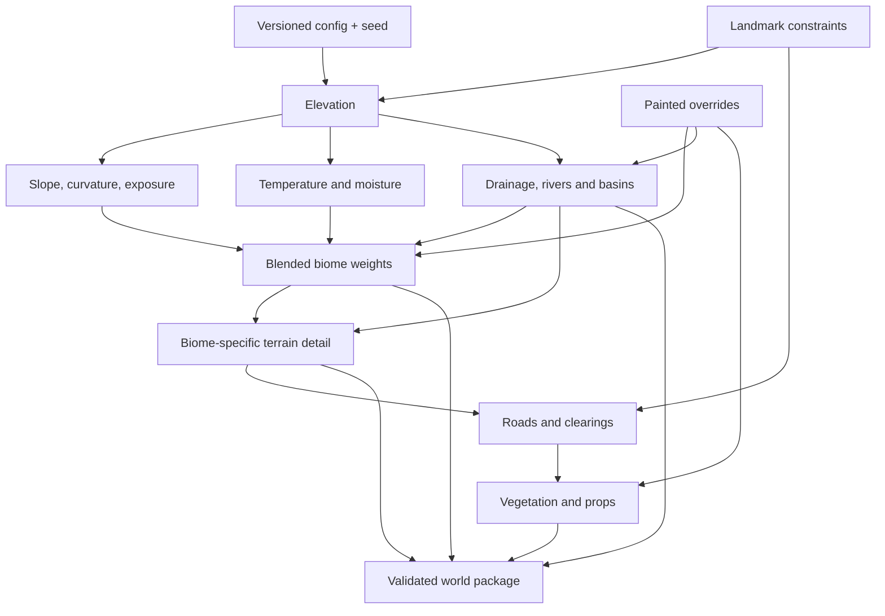

# Exalted procedural world generator plan

## Goal

Build a deterministic generator for an exact **2 × 2 km** Exalted world with
terrain, climate, blended biomes, water, vegetation placement, landmarks, roads,
and editable overrides.

All generator-specific source, schemas, preparation tools, tests, reports, and
generated working data belong under `generator/`. The production application
loads a prepared world package and does not depend on generator UI or tooling.

The existing procedural snow terrain is the technical foundation:

- Static nested-ring clipmap.
- GPU height baking.
- CPU readback for matching grounding.
- Shared WGSL terrain functions.
- Analytic fine detail.
- Persistent local deformation.

The generator extends this foundation from one snow landscape into a reproducible
multi-biome world.

## Visual quality target

The target is an **AAA visual feeling at player scale**, while retaining quality
tiers that allow the world to run on the intended hardware. Procedural generation
must produce art-directable source data; procedural output alone is not considered
finished scenery.

The visual bar requires:

- A strong large-scale silhouette with recognizable mountain ranges, valleys,
  watersheds, biome regions, and authored vistas.
- Terrain detail at macro, meso, and micro scales without visible repetition or
  obvious noise-function patterns.
- Broad, irregular biome transition zones driven by elevation, slope, moisture,
  exposure, and authored masks instead of simple colour bands.
- Physically coherent terrain materials with calibrated albedo, roughness,
  normals, displacement, macro variation, and distance-aware detail reduction.
- Material blending that avoids seams, texture swimming, uniform tiling, and
  implausible accumulation on steep surfaces.
- Dense hierarchical vegetation with species communities, age and scale
  variation, edge treatment, clearings, fallen material, and local hero assets.
- Consistent grounding for rocks, trees, buildings, roads, water, and the avatar,
  including contact shadows and terrain/material response around placed assets.
- Water shaped by the same hydrology data as the terrain, with believable banks,
  wetness, foam, spray, and transitions into lakes and waterfalls.
- Stable lighting, shadows, atmosphere, fog, reflections, and post-processing
  while the camera moves. Camera-relative systems must not reveal moving seams.
- High-quality deformation for snow, sand, and later soft surfaces, with material
  response matching depth, compaction, disturbed normals, and surface colour.
- Authored landmark passes after generation so important routes, spawn points,
  vistas, and biome identities receive deliberate composition.

Every major generator feature must be judged from ground-level gameplay views as
well as aerial debug views. Performance shortcuts must degrade gradually through
LOD, density, shadow, and material quality tiers rather than introduce obvious
popping, cards, hard rings, or changes that track the camera.

The generator editor will eventually include locked comparison cameras and
repeatable lighting conditions for visual reviews. Reference captures should be
kept for critical locations so changes to generation, materials, and rendering can
be compared consistently.

## Directory boundary

Proposed structure:

```text
generator/
  PLAN.md
  README.md
  package/
    schema.ts
    manifest.ts
    versions.ts
  config/
    world.ts
    biomes.ts
    landmarks.ts
  fields/
    elevation.ts
    climate.ts
    hydrology.ts
    biomes.ts
    roads.ts
    overrides.ts
  gpu/
    register.ts
    elevationBake.fragment.wgsl
    climateBake.fragment.wgsl
    biomeBake.fragment.wgsl
    hydrology/
  placement/
    vegetation.ts
    rocks.ts
    landmarks.ts
    chunks.ts
  editor/
    index.html
    main.ts
    editor.ts
    controls.ts
    painting.ts
    preview.ts
    editor.css
  scripts/
    generate.mts
    inspect.mts
    pack.mts
  tests/
    config.test.ts
    climate.test.ts
    biomes.test.ts
    hydrology.test.ts
    determinism.test.ts
    package.test.ts
  reports/
  work/
```

`generator/work/` and large intermediate textures should be ignored by Git.
Small manifests, schemas, tests, and intentional reference outputs may be tracked.

The runtime-facing loader and rendering integration remain under `src/`, for
example:

```text
src/world/generatedWorld.ts
src/world/generatedWorldManifest.ts
src/terrain/generatedHeightfield.ts
```

These modules may consume the package schema, but they must not import the
generator editor, scripts, or implementation-only field builders.

## Initial world contract

```json
{
  "generator": "exalted-world",
  "generatorVersion": 1,
  "packageVersion": 1,
  "seed": 482913,
  "width": 2000,
  "depth": 2000,
  "origin": [-1000, -1000],
  "heightResolution": 4000,
  "biomeResolution": 1000,
  "waterResolution": 1000,
  "chunkSize": 32
}
```

This provides:

- Exact bounds from -1000 to +1000 m on X and Z.
- 0.5 m baked height samples.
- 2 m biome and water samples.
- 32 m placement and streaming chunks.
- A clipped 16 m far-edge chunk because the exact 2,000 m extent does not divide
  evenly by 32 m; chunk counts use ceiling division.
- A stable seed and explicit generator version.

The generator version is part of world identity. Changing algorithms without
changing the version is forbidden because the same seed must reproduce the same
world package.

## Generated outputs

The first package should contain:

```text
generated-world/
  world.json
  height.bin
  terrain-aux.ktx2
  biomes-0.ktx2
  biomes-1.ktx2
  water-mask.ktx2
  water.json
  roads.json
  landmarks.json
  placements/
    manifest.json
    chunk_<x>_<z>.bin
```

During early development, PNG and uncompressed binary output are acceptable.
KTX2 and compact chunk formats belong to the packaging stage.

## Authoritative coordinate conventions

- Units are metres.
- Positive Y is up.
- World X/Z bounds are inclusive at -1000 and +1000.
- Texture origin and row orientation must be explicit in the manifest.
- CPU and GPU sampling use the same pixel-centre convention.
- World coordinates remain stable across regeneration.
- Placement chunks use floor division so negative coordinates are deterministic.

Every generated field records:

- Width and height.
- World origin and extent.
- Format and channel meaning.
- Sampling mode.
- Whether values represent texel centres or edges.
- Content hash.

## Generation pipeline



Generation order is part of the contract. Later stages can read earlier fields;
earlier stages must not depend on later output.

## Elevation

Retain the current GPU bake and extend its broad landform layers:

- Continental or regional base shape.
- Mountain chains.
- Valleys and passes.
- Plateaus.
- Desert dune regions.
- Erosion and drainage shaping.
- Landmark flattening or reserved regions.

Separate scale bands:

1. World structure: 200–2000 m wavelengths.
2. Regional landforms: 30–300 m.
3. Local terrain: 2–40 m.
4. Material detail: below 2 m.

Only the first three belong in the baked height field. Fine snow, sand, soil, and
rock detail remains analytic or texture-driven in rendering.

The baked height field is authoritative. CPU grounding reads back or loads the
same values used by the vertex shader.

## Climate

Generate deterministic temperature and moisture.

Temperature inputs:

- North/south position.
- Elevation lapse rate.
- Regional noise.
- Optional seasonal parameter later.

Moisture inputs:

- Distance from water.
- Prevailing wind direction.
- Mountain rain shadow.
- Drainage accumulation.
- Regional noise.

Both fields are normalized to 0–1 and independently inspectable.

## Biomes

Initial channels:

| Map | Channel | Biome |
| --- | --- | --- |
| 0 | R | Desert |
| 0 | G | Grassland |
| 0 | B | Forest |
| 0 | A | Snow |
| 1 | R | Rock |
| 1 | G | Wetland |
| 1 | B | Shore |
| 1 | A | Settlement or structural override |

Biome values are weights, not exclusive IDs. At each sample:

```text
sum(weights) = 1
weight >= 0
```

Inputs include temperature, moisture, elevation, slope, curvature, water
distance, and structural overrides.

Example tendencies:

- Hot, dry, gentle terrain → desert.
- Mild, moderately moist terrain → grassland.
- Wet, mild, plantable slopes → forest.
- Cold or high terrain → snow.
- Steep or exposed terrain → rock.
- Wet, low, flat terrain near water → wetland.
- Water boundary → shore.
- Authored town or road region → settlement override.

Add large-scale domain noise to transitions without destroying geographic logic.

## Biome-specific terrain detail

Material progress:

- [x] Stable eight-layer terrain material catalog in biome-channel order.
- [x] Physical tile scales and OpenGL normal/packed AO-roughness-height contract.
- [x] Distance-filtered procedural micro-normal fallback.
- [ ] Assign production tileable PBR source textures.
- [ ] Build KTX2 texture arrays and separate production/diagnostic terrain materials.
- [ ] Height-aware stochastic tiling and slope triplanar sampling.

Biome classification selects additional terrain character:

| Biome | Detail |
| --- | --- |
| Desert | Broad dunes, ripples, wind scouring |
| Grassland | Low rolling soil and sparse hummocks |
| Forest | Gentler soil, roots and drainage shaping later |
| Snow | Drifts, sastrugi and wind ripples |
| Rock | Ridges, outcrops and erosion |
| Wetland | Flat saturated ground and shallow channels |
| Shore | Smoothed bank and beach profile |
| Settlement | Flattening and authored surface overrides |

Blend detail functions with biome weights. Avoid evaluating every expensive detail
function everywhere; use region masks or generated detail channels when needed.

## Deformation behavior

The current persistent local deformation buffer remains shared.

Biome weights select response:

| Biome | Deformation |
| --- | --- |
| Snow | Deep compression, raised berms, slow refill |
| Desert | Broad loose-sand displacement and faster slump |
| Grassland | Minimal soil depression |
| Forest | Firm soil; optional leaf or snow surface later |
| Rock | None |
| Wetland | Shallow mud response or water effects later |
| Shore | Wet compact sand |
| Settlement | Usually disabled |

Brushes crossing biome boundaries blend material response continuously.

## Hydrology

Hydrology stages:

1. Resolve sinks or identify intended basins.
2. Calculate drainage direction.
3. Accumulate upstream flow.
4. Select river paths.
5. Define lake basins and water levels.
6. Cut riverbeds and soften banks.
7. Generate water meshes or splines.
8. Identify steep river sections for waterfalls.

Allow explicit constraints:

- Required lake centres and approximate levels.
- Required river sources and exits.
- Forbidden water regions.
- Waterfall hints.
- Settlement protection zones.

Automatic hydrology produces a first result. The editor supports corrections
before packaging.

## Landmarks and named regions

Named Exalted locations must remain reproducible. A landmark can constrain:

- Position.
- Required biome.
- Minimum flat radius.
- Height range.
- Vegetation exclusion.
- Road connection.
- Water relationship.
- Spawn position and facing.

Initial required landmark classes:

- Desert starting spawn.
- Snow biome spawn.
- Forest spawn.
- Lake.
- Waterfall.
- Future settlement and quest locations.

The generator shapes terrain around landmark constraints rather than placing
landmarks after generation and accepting intersections.

## Roads and clearings

Roads are a structural override layer:

- Connect selected landmarks.
- Prefer gentle slopes.
- Avoid deep water unless a crossing is requested.
- Smooth local terrain.
- Suppress large vegetation.
- Write road or settlement weight.
- Retain deterministic control points.

Represent roads as splines plus generated masks. Do not bake their only
representation into a biome texture.

## Vegetation and props

Generate deterministic candidate placements from biome weights and terrain rules.

### GLB asset catalog

The generator will later accept GLB prototypes for trees, bushes, grasses, rocks,
fallen wood, and other biome props. Importing an asset adds a catalog entry rather
than embedding file-specific logic in the biome generator.

Each catalog entry defines:

- Stable prototype ID, display name, category, and source GLB path.
- Eligible biomes and a placement weight for each biome.
- Geometry LOD assets or mesh mappings, including an optional distant card.
- Allowed scale range, yaw variation, tilt, density, and clustering behavior.
- Preferred slope, elevation, moisture, exposure, and water-distance ranges.
- Grounding data: pivot correction, burial depth, footprint radius, and bounds.
- Collision policy such as none, trunk, simple hull, or authored collision mesh.
- Wind profile and the meshes or vertex channels affected by wind.
- Shadow distance, material classification, and render quality requirements.
- Seasonal or regional variants where applicable.

Asset preparation validates the GLB once and writes compact metadata for the
generator and runtime. Validation checks dimensions, transforms, pivots, material
slots, texture colour spaces, alpha mode, UVs, normals, tangents, LOD consistency,
collision data, and unsupported extensions. Source GLBs remain replaceable without
changing placement rules as long as their prototype IDs and contracts remain
compatible.

The editor will provide an asset-library panel to import, inspect, preview, tag,
and tune prototypes. A ground-level preview scene will show scale, wind, shadows,
LOD transitions, collision, and material response under the production world
lighting. Biome palettes can then combine several prototypes with weighted,
deterministic distribution rules.

Each placement records:

- Prototype ID.
- World position.
- Rotation.
- Scale.
- Biome.
- Generator seed.
- 32 m chunk coordinate.

Rules consider:

- Biome weight.
- Slope.
- Moisture.
- Height.
- Distance from water and roads.
- Landmark exclusions.
- Deterministic density noise.

Runtime rendering follows the retained forest specification:

- 32 m chunks.
- Thin instances.
- Two geometry LOD levels.
- Stable shadows.
- Root-anchored wind.
- Trunk-only collision for trees.

## Overrides

Manual work is saved as data layered over generated fields:

- Height additions or absolute corrections.
- Biome paint.
- Water inclusion and exclusion.
- Road spline edits.
- Vegetation inclusion and exclusion.
- Landmark moves.

Never edit generated output without recording an override. Regeneration must
reproduce the same final package from config, seed, and overrides.

## Generator editor

Create a separate editor under `generator/editor/`.

Generated-world rendering is developed and reviewed on the dedicated
`generator/generated-world.html` page. It must not replace or patch the playable
root page while generator stages are incomplete. The preview imports generator
fields directly during development; an approved production package will later be
loaded through the runtime package boundary.

Initial tools:

- Seed and version display.
- Generate and regenerate.
- Height, slope, temperature, moisture, water, and biome debug views.
- Biome paint and erase.
- Height correction brush.
- Water correction brush.
- Landmark placement.
- Road spline editing.
- Vegetation density preview.
- GLB asset import, validation, preview, and biome-palette editing.
- Fixed camera bookmarks.
- Save overrides.
- Export package and report.

The editor may reuse production sky, post-processing, terrain materials, and
camera utilities. Production code must not depend on editor UI.

## Runtime architecture

Runtime loading should be simple:

1. Load and validate `world.json`.
2. Load height and auxiliary textures.
3. Create the CPU height sampler.
4. Load biome and water fields.
5. Build water geometry.
6. Load nearby placement chunks.
7. Start terrain deformation and normal frame updates.

World generation should not occur during normal player startup once a package is
approved. A development query may generate directly for experimentation.

## Staged implementation

### Stage 1 — Contract and deterministic fields

Deliver:

- `generator/package` schema and version types.
- Exact 2 × 2 km configuration.
- Seeded hash/noise utilities.
- Temperature and moisture sampling.
- Eight normalized biome weights.
- Boundary and determinism tests.

Acceptance:

- Same version, seed, and coordinates return identical values.
- All weights are finite, non-negative, and sum to one.
- Exact world bounds and pixel-centre conventions are tested.
- No production visuals change yet.

### Stage 2 — Integrate elevation

Deliver:

- [x] Move or adapt current procedural height bake under generator ownership.
- [x] Exact 2000 m extent and 4000² offline bake.
- [x] CPU height loading and bilinear sampling.
- [x] Height, slope, curvature, and exposure reports.
- [x] Upload the baked field to the GPU terrain renderer.
- [x] Verify CPU and GPU samples against the same texel-centre transform.

Acceptance:

- CPU and GPU height agree within the established sampling tolerance.
- Terrain is valid at all four edges.
- Existing movement, camera grounding, and deformation still work.

### Stage 3 — Biome bake and debug rendering

Deliver:

- [x] Climate and biome bake passes.
- [x] Two biome textures.
- [x] CPU biome sampling.
- [x] Terrain debug modes.
- [x] Biome-aware base colour.
- [x] GPU biome probe/readback parity.

Acceptance:

- [x] CPU and GPU classifications agree.
- [x] Transitions are smooth and normalized.
- [x] All eight channels are inspectable.

### Stage 4 — Biome materials and deformation

Deliver:

- [x] Procedural desert, grassland, forest floor, snow, rock, wetland, shore,
  and settlement preview appearance.
- [x] Biome-specific deformation response contract and CPU blending.
- [x] Interactive local deformation on the generated-world preview.
- [x] Matching beauty and shadow displacement; depth follows the beauty vertex path.

Acceptance:

- Snow and sand deform differently.
- Firm surfaces do not deform.
- Boundary footprints blend without discontinuities.

### Stage 5 — Hydrology

Progress:

- [x] Deterministic D8 flow direction and accumulation bake.
- [x] Flow direction and water accumulation debug views.
- [x] Depression filling and lake classification.
- [x] Sparse visible network selection: one primary and two small rivers.
- [x] River tracing, derived terrain carving, and waterfall emitter metadata.
- [x] Unified runtime water mask, surface heights, and preview rendering.
- [x] Downhill validation, shoreline mask, swimming depth, and inspection controls.

Deliver:

- Drainage and accumulation.
- Lake, river, and waterfall generation.
- Water mask and metadata.
- Editor corrections.

Acceptance:

- [x] Rivers flow downhill after terrain carving.
- [x] Lakes have consistent levels.
- [x] Islands and shorelines remain valid for swimming.
- [x] Waterfall emitters correspond to steep water geometry.

### Stage 6 — Landmarks and roads

Progress:

- [x] Deterministic generic region and spawn selection.
- [x] Dry-ground, slope, and 220 m separation constraints.
- [x] Preview navigation for generated locations.
- [x] Landmark terrain clearance constraints.
- [x] Sparse dry road routing and preview mask.
  - [x] Road grading and terrain displacement with bounded cut/fill shoulders.

Deliver:

- Stable named regions and spawn points.
- Landmark terrain constraints.
- Road routing and masks.
- Clearing and placement exclusions.

Acceptance:

- Required locations survive regeneration.
- The initial avatar spawn is visibly in desert.
- Roads connect selected locations without invalid slopes or water crossings.

### Stage 7 — Vegetation and props

Progress:

- [x] Deterministic biome-aware placement foundation.
- [x] Compact binary placement records with 32 m chunk ranges.
- [x] Water, road, landmark, and slope exclusions.
- [x] Versioned GLB asset catalog and structural validation report.
- [ ] Asset preview and biome-palette controls.
- [ ] Runtime nearby-chunk loading and prototype instancing.

Deliver:

- Versioned GLB asset catalog and validation report.
- Asset preview and biome-palette controls in the generator editor.
- Per-prototype placement, grounding, wind, collision, shadow, and LOD metadata.
- Deterministic biome-aware placement.
- 32 m output chunks.
- Prototype manifest.
- Runtime nearby-chunk loading.

Acceptance:

- Regeneration produces byte-stable placements.
- LOD and density do not change collision locations.
- Runtime loads only relevant chunks.

### Stage 8 — Editor and overrides

Deliver:

- Generator editor page.
- Field debug views.
- Biome, height, water, road, and exclusion editing.
- Versioned override files.

Acceptance:

- Regeneration plus overrides reproduces the edited world.
- Editor and command-line package output agree.

### Stage 9 — Packaging and runtime switch

Deliver:

- `generator/scripts/generate.mts`.
- `generator/scripts/inspect.mts`.
- `generator/scripts/pack.mts`.
- Compact runtime package.
- Generated-world runtime loader.

Acceptance:

- Package validation passes.
- Normal startup does not run generator algorithms.
- Fixed-view visual and performance checks pass.
- Existing imported Exalted terrain remains available until the generated world
  is explicitly accepted as its replacement.

## Commands

Planned commands:

```bash
npm run world:generate
npm run world:inspect
npm run world:pack
npm run world:test
npm run world:editor
```

Do not add these scripts until their implementation exists.

## Tests

Automated tests should cover:

- Exact world bounds.
- Negative-coordinate chunk indexing.
- Seed determinism.
- Generator-version identity.
- Climate ranges.
- Biome normalization and expected tendencies.
- CPU/GPU height sampling.
- Water downhill constraints.
- Stable landmark positions.
- Stable placement output.
- Override application order.
- Package hashes and schema validation.

GPU appearance, biome quality, water shape, and vegetation density require manual
fixed-view review.

## Performance budgets

Initial targets:

- Height: 4000², 0.5 m per texel.
- Biomes: 1000², 2 m per texel.
- Water: 1000², 2 m per texel.
- Placement chunks: 32 m.
- Interactive runtime generation cost: none for approved packages.
- Editor regeneration may take seconds and show staged progress.

Do not increase resolution until fixed-view inspection demonstrates a visible
need. Local procedural detail and deformation provide sub-texel surface quality.

## Risks

| Risk | Control |
| --- | --- |
| Same seed changes after code edits | Explicit generator version |
| CPU and GPU disagree | Bake once and sample identical output |
| Biomes look like noise patches | Climate and landform rules before transition noise |
| Rivers climb or cross ridges | Hydrology validation after terrain carving |
| Manual edits disappear | Versioned override layer |
| World edges visibly clamp | Edge shaping, play bounds, fog, and edge tests |
| Excessive vegetation data | Deterministic 32 m chunks and density budgets |
| Generator leaks into runtime | Package boundary and one-way dependency rules |

## First milestone

Implement Stage 1 entirely inside `generator/`:

- [x] Exact world manifest and schema.
- [x] Stable generator and package versions.
- [x] Seeded deterministic noise.
- [x] Temperature field.
- [x] Moisture field.
- [x] Eight-channel normalized biome sampler.
- [x] Boundary, determinism, and normalization tests.
- [x] Short generated-field audit report.

This creates the stable contract required before changing the current terrain
bake or visible world.
